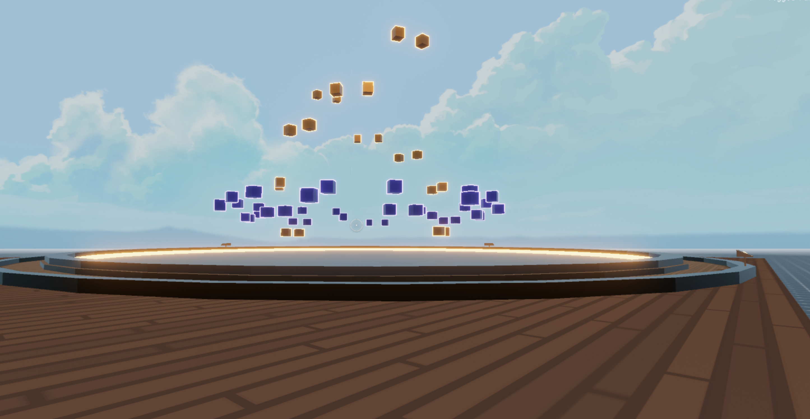

# Blcok Fountain

A cube-based fountain with multiple animations that uses P2P to sync animations between players.



This scene shows you:

- How to use websockets to sync events between players
- How to handle multiple animations in a same model
- How to keep the scene's code abstracted into various game objects with state and methods of their own
- How to handle random events


## Try it out

**Install the CLI**

Download and install the Decentraland CLI by running the following command:

```bash
npm i -g decentraland
```

**Previewing the scene**

Download this example and navigate to its directory, then run:

```
$:  dcl start
```

Any dependencies are installed and then the CLI opens the scene in a new browser tab.

**Scene Usage**

The fountain has four rings of cubes that each behave independently, each ring has three different animations. 

If left alone, these animations will be randomly triggered at random intervals. These random events aren't synced between players. 

If a player pushes one of the buttons, this will trigger the corresponding animation. The random behavior will stop for a given amount of time, and the animation triggered by the button is synced with all other players in the scene.

You can test this by opening the preview on multiple browser windows. If a player pushes a button on one of these instances, all other players should see the same animation play at the same time.


Learn more about how to build your own scenes in our [documentation](https://docs.decentraland.org/) site.

If something doesn’t work, please [file an issue](https://github.com/decentraland-scenes/Awesome-Repository/issues/new).

## Copyright info

This scene is protected with a standard Apache 2 licence. See the terms and conditions in the [LICENSE](/LICENSE) file.

